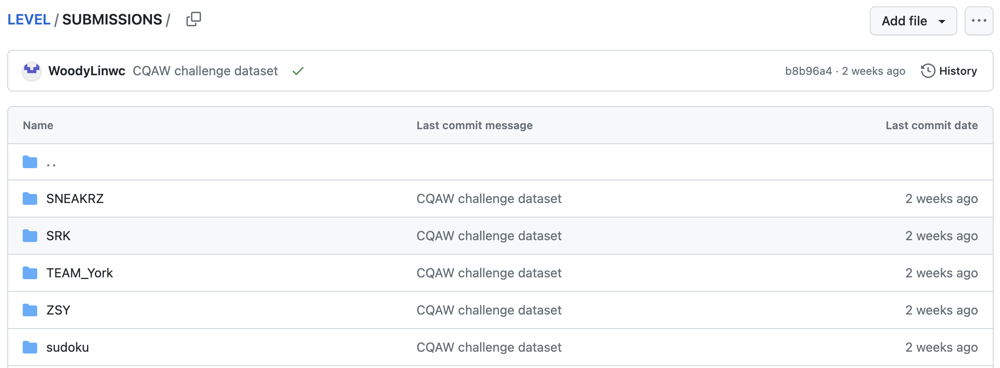
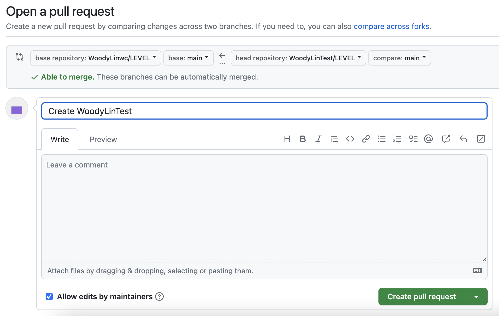

    
 Submit your results

    
Step 1: Fork the repository <a target="_blank" href="https://github.com/WoodyLinwc/LEVEL">here</a>

    
Step 2: Add your results under the <a target="_blank" href="https://github.com/WoodyLinwc/LEVEL/tree/main/SUBMISSIONS">SUBMISSIONS</a> folder 

    
    
Step 3: Create Pull Request

    

